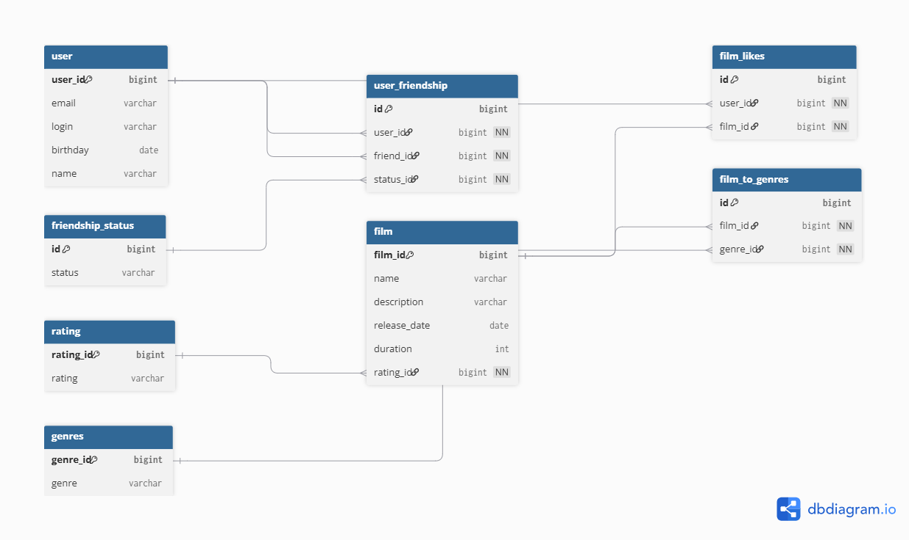

# java-filmorate

Template repository for Filmorate project.

## SQL SCHEME



#### Main table

- User (User.java)
- Film (Film.java)

#### Ref table

- User < ( user_friendship & film_likes )

**user_friendship** It is a table where all interactions between users are tracked. (One-to-Many)

**film_likes** It is a table that displays all the user’s likes for movies. (One-to-Many)

- Film < ( film_to_genres & film_likes )

**film_to_genres** It is a table that displays movies and their corresponding genres. (One-to-Many)

**film_likes** -- (One-to-Many)

_Because a single film & user object can have many records in the tables mentioned above._

### Query examples

**GetAllUsers**

```sql
SELECT *
FROM user
```

**GetUnconfirmedFriends**

```sql
SELECT login
FROM user
WHERE user.id IN (SELECT friend_id FROM user_friendship WHERE user_id = N.id AND status_id = 1);
```

**GetCommonFriends**

```sql
SELECT name
FROM user
WHERE user.id IN (SELECT friend_id FROM user_friendship WHERE user_id = N.id AND status_id = 0)
  AND user.id IN (SELECT friend_id FROM user_friendship WHERE user_id = J.id AND status_id = 0);
```

**GetAllFilms**

```sql
SELECT *
FROM film
```

**GetFilmByGenre**

```sql
SELECT f.name
FROM Film AS f
         JOIN film_to_genres AS ftg1 ON f.film_id = ftg1.film_id AND ftg.genre_id = N.id
         JOIN film_to_genres AS ftg2 ON f.film_id = ftg2.film_id AND ftg2.genre_id = J.id;
```


